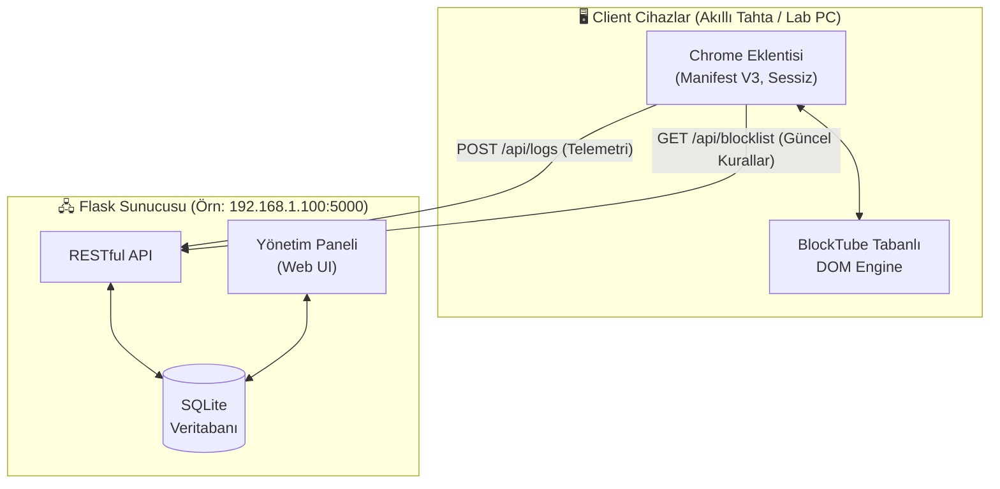

# NetKalkan


[](https://www.python.org/)
[](https://flask.palletsprojects.com/)
[](https://developer.chrome.com/docs/extensions/mv3/)
[](https://www.sqlite.org/)
[](https://www.gnu.org/licenses/gpl-3.0)

Okul ve kurum ağlarındaki bilgisayarlar, akıllı tahtalar ve laboratuvarlar için tasarlanmış **yerel ağ odaklı (offline-first), gizlilik merkezli telemetri ve içerik engelleme sistemi.**

---

## 📌 Projenin Amacı ve Felsefesi

Okullardaki akıllı tahtalar ve laboratuvar bilgisayarlarında genellikle kişisel kullanıcı oturumu açılmaz. Bu durum, Google'ın sunduğu "YouTube Kısıtlı Mod" veya benzeri bulut tabanlı güvenlik önlemlerinin yetersiz kalmasına neden olur. 

**NetKalkan**, bu sorunu çözmek için geliştirilmiş bir **"Telemetri ve Uzaktan Kapatma (Kill-Switch)"** sistemidir. 
- Piyasada bulunan hazır çözümlerin aksine tamamen **yerel ağda (Local Network)** çalışır.
- Verileriniz dışarıdaki bir sunucuya gitmez, gizlilik odaklıdır (FOSS felsefesi).
- [BlockTube](https://github.com/amitbl/blocktube) eklentisinin açık kaynaklı, güçlü DOM manipülasyon motorundan ilham alarak kendi merkezi yapımıza entegre edilmiştir.

---

## ✨ Özellikler

- **Merkezi Yönetim**: Ağdaki tüm cihazların kara listeleri ve ayarları tek bir Flask sunucusu üzerinden kontrol edilir.
- **Sessiz Çalışma**: Chrome eklentisinin arayüzü (Popup) yoktur, arka planda tamamen görünmez çalışır.
- **Toplu Raporlama (Batch Logging)**: Ağı yormamak için loglar anlık gönderilmez, biriktirilerek sunucuya toplu aktarılır.
- **Kapsamlı Liste Yönetimi**: 
  - Sadece URL değil; **Kanal ID**, **Video ID**, **Anahtar Kelime** ve **Regex** bazlı engelleme yapılabilir.
  - **Beyaz Liste (Whitelist)** ile eğitim kanallarının asla engellenmemesi garanti altına alınır.
- **Global Kill-Switch**: Acil durumlarda tek tıkla ağdaki tüm engelleme motoru durdurulabilir.
- **Silinmezlik**: Windows Kayıt Defteri (Registry/Group Policy) kullanılarak eklentinin silinmesi veya devre dışı bırakılması engellenir.
- **Uzaktan Konfigürasyon**: Eklentinin senkronizasyon aralığı ve log saklama politikaları panelden yönetilir.

---

## 🏗️ Mimari Şema



Sistem üç ana bileşenden oluşur:
1. **Chrome Eklentisi (İstemci):** Group Policy ile kurulan, arka planda (Manifest V3) çalışan modül.
2. **Flask Sunucusu (Merkez):** Logları toplayan, kuralları dağıtan ve veritabanını (SQLite) yöneten backend.
3. **Yönetim Paneli:** Flask üzerinden sunulan, yöneticilerin sistemi kontrol ettiği arayüz.

---

## 🚀 Kurulum ve Dağıtım

### 1. Flask Sunucusunun Ayağa Kaldırılması

Sunucuyu statik IP'ye sahip bir makinede veya yerel sunucuda başlatmanız önerilir.

```bash
# Proje dizinine gidin
cd server

# Python sanal ortamı oluşturun ve aktifleştirin
python -m venv venv
venv\Scripts\activate  # Windows

# Bağımlılıkları yükleyin
pip install -r requirements.txt

# Sunucuyu başlatın (Tüm ağa hizmet vermesi için host=0.0.0.0)
python app.py
```

*Sunucu varsayılan olarak `http://0.0.0.0:5000` adresinde çalışacaktır. Yönetim paneline girmek için tarayıcıda `http://localhost:5000` adresine gidin. (Varsayılan giriş: `admin` / `netkalkan2026`)*

### 2. Chrome Eklentisi Yapılandırması

Sunucu IP'niz farklıysa eklentiyi kurmadan önce ayarları güncelleyin:
1. `extension/lib/api-client.js` dosyasını açın.
2. `API_BASE_URL` değişkenini sunucunuzun IP adresiyle değiştirin (Örn: `http://192.168.1.50:5000/api`).

### 3. İstemcilere Dağıtım (Force Install via Registry)

Eklentiyi cihazlara tek tek kurmak yerine Windows Kayıt Defteri ile zorunlu (forced) kurabilirsiniz.

1. Eklenti dizinini Chrome üzerinden "Uzantıyı Paketle (Pack Extension)" diyerek `.crx` formatına getirin (veya Chrome Web Mağazasına gizli olarak yükleyin).
2. `extension/deploy/install_policy.reg` dosyasını düzenleyin:
   - `abcdefghijklmnopabcdefghijklmnop` yerine kendi eklenti ID'nizi yazın.
   - Update URL kısmını belirtin.
3. Bu `.reg` dosyasını Active Directory (GPO) üzerinden tüm laboratuvar cihazlarına dağıtın.

---

## 🛡️ Gizlilik ve Etik Uyarı (FOSS Disclaimer)

Bu araç; yalnızca yetkili olduğunuz okul, şirket veya ev ağlarında, yerel güvenlik politikalarını uygulamak maksadıyla kullanılmak üzere tasarlanmıştır.

**Önemli:** Eklenti tarafından toplanan hiçbir veri (URL, IP adresi, hostname vb.) üçüncü taraf sunuculara veya internete **gönderilmez**. Veriler tamamen kendi kurduğunuz yerel ağdaki (Local Network) sunucuda kalır ve işlenir. 

*Projeye ait engelleme motoru, [amitbl/blocktube](https://github.com/amitbl/blocktube) projesinin GPL-3.0 lisanslı kaynak kodlarından ilham alınarak geliştirilmiştir. Emeği geçen açık kaynak geliştiricilerine teşekkürler.*